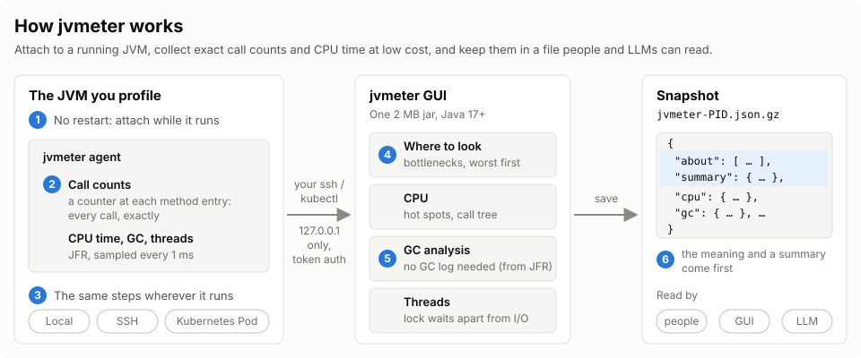
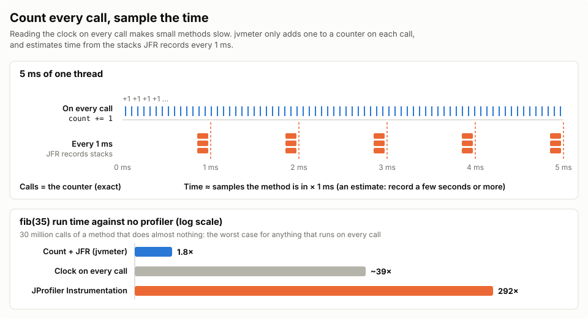
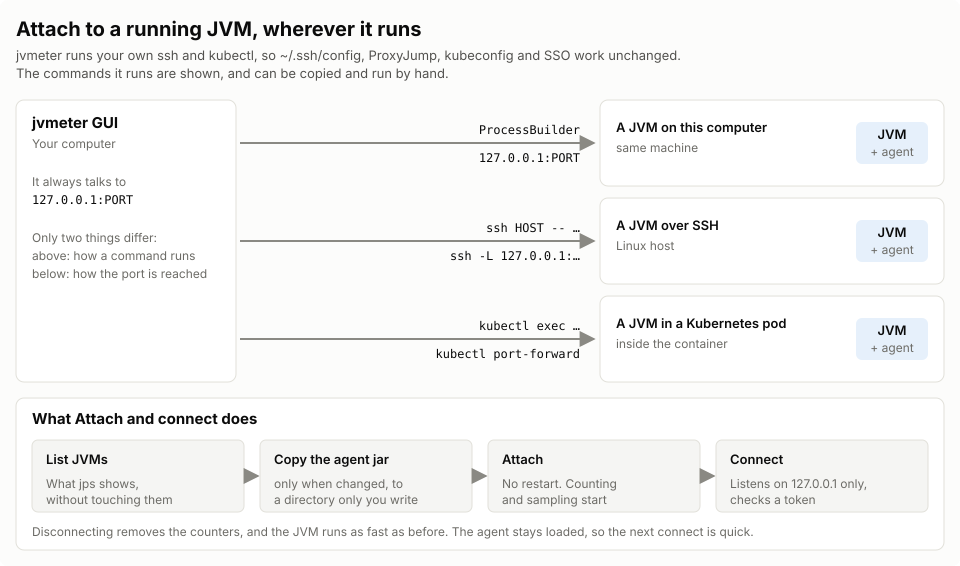
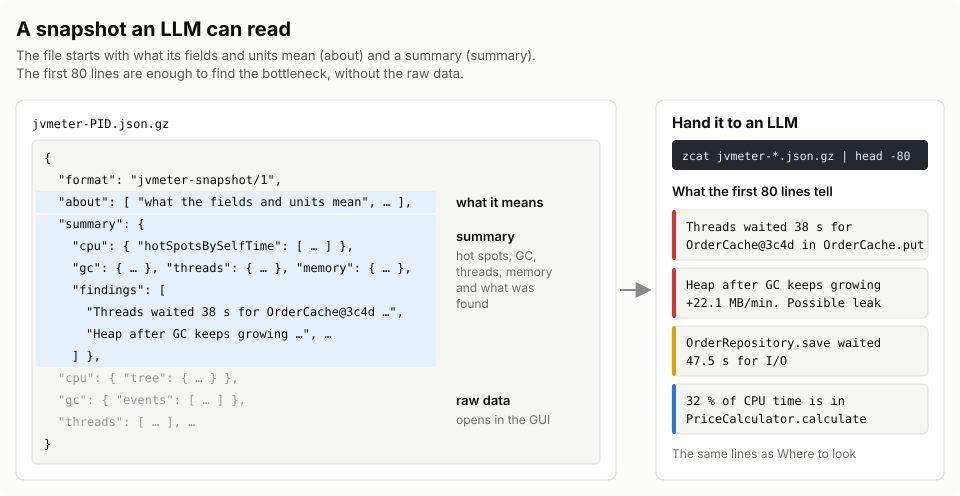

# jvmeter

[](https://github.com/yukkes/jvmeter/actions/workflows/release.yml)
[](https://github.com/yukkes/jvmeter/releases)
[](#building-from-source)
[](LICENSE)

**English** | [日本語](README_ja.md)

**An open-source JVM profiler with low overhead and exact call counts**

Calls are counted exactly by bytecode instrumentation; CPU time is measured cheaply by JFR (Java Flight Recorder) sampling.
Attach to a JVM that is already running, on your machine, on a remote server over SSH, or in a Kubernetes pod, with the same steps.
Results are saved as a compact JSON snapshot: open it in the GUI, or hand it straight to an LLM to find the cause.


---

## 📌 Contents
- [Features](#features)
- [How it works](#how-it-works)
- [Quick start](#quick-start)
  - [1. Attach to a running JVM (recommended)](#1-attach-to-a-running-jvm-recommended)
  - [2. Record from startup with the agent](#2-record-from-startup-with-the-agent)
- [Views](#views)
- [Recommended JVM options](#recommended-jvm-options)
- [Overhead](#overhead)
- [Agent options and CLI](#agent-options-and-cli)
- [Security and privacy](#security-and-privacy)
- [Building from source](#building-from-source)
- [License](#license)

---

## Features



*The numbers in the figure match the rows of the table below.*

| # | Feature | In short | More |
|:---:|---|---|---|
| **①** | **No restart** | When trouble starts, attach to the running JVM from the GUI. | [Attaching](#1-attach-to-a-running-jvm-recommended) |
| **②** | **Exact call counts at low cost** | About 1.8× in the worst case (JProfiler's Instrumentation: about 290×). | [How it works](#how-it-works) / [Overhead](#overhead) |
| **③** | **The same steps everywhere** | Local, SSH and Kubernetes all go through your own `ssh` / `kubectl`. Nothing needs to be installed there first. | [Attaching](#1-attach-to-a-running-jvm-recommended) |
| **④** | **Shows where to look** | The bottlenecks found in the data, most severe first. | [Views](#views) |
| **⑤** | **GC analysis without GC logs** | GCeasy-style metrics and problem rules, computed from JFR events. Nothing is sent anywhere. | [GC analysis](docs/gc-analysis.md) |
| **⑥** | **Snapshots an LLM can read** | The first 80 lines of the JSON hold the gist of the profile. | [Snapshots and LLMs](#reading-a-snapshot-and-handing-it-to-an-llm) |

- **No Java to install**: the GUI (Swing + FlatLaf, agent included) comes as an app with a Java runtime of its own for Windows, macOS and Linux.
- **Open source**: MIT License.

---

## How it works

### 1. Count every call, sample the time
Profilers that instrument methods read a timer at every method entry and exit, which is very slow; pure sampling cannot count calls.
jvmeter splits the job: **calls are counted with a cheap increment, time comes from JFR sampling**, so it is both exact and light.



### 2. Attach from anywhere
Not only local processes: JVMs on SSH hosts and in Kubernetes pods are profiled safely through the client tools you already use.
The agent is bundled in the GUI and copied to the server or container when you attach (skipped when the same jar is already there), so nothing needs to be installed there first.



### 3. A small snapshot an LLM can read as is
Results are written as gzip-compressed JSON (`.json.gz`). What the fields mean (`about`) and the key results (`summary`) come first,
so handing the top of a snapshot to an LLM is enough for it to point at the bottleneck.



---

## Quick start

Download the app for your OS from [Releases](https://github.com/yukkes/jvmeter/releases) and unpack it. No Java needs to be installed; the agent is bundled.

| File | Start |
|---|---|
| `jvmeter-<version>-windows-x64.zip` | `jvmeter\jvmeter.exe` |
| `jvmeter-<version>-macos-arm64.zip` | `jvmeter.app` |
| `jvmeter-<version>-linux-x64.tar.gz` | `jvmeter/bin/jvmeter` |

The apps are not signed: on macOS, allow jvmeter in **System Settings › Privacy & Security** the first time it is blocked; on Windows, choose **More info › Run anyway**.

### 1. Attach to a running JVM (recommended)

1. Start jvmeter: the **Start Center** opens.
2. Choose **Local**, **SSH** or **Kubernetes**; the JVMs found there are listed.
3. Select a JVM and enter the packages whose calls should be counted in **Count calls in** (for example `com.example`).
4. Click **Attach and connect**: recording starts, and the views update every second.
5. **Save** (the download icon in the top bar) saves a snapshot.

> **Tip:** to see the views right away, open **Sample data** in the Start Center (a profile of a made-up order service).

---

### 2. Record from startup with the agent

To profile a process from its start to its exit, such as a batch job, add the agent to the JVM's options.
The agent jar and the demo apps are not in the release: [build them from source](#building-from-source).

```bash
java -XX:+UnlockDiagnosticVMOptions -XX:+DebugNonSafepoints \
  -javaagent:jvmeter-agent.jar \
  -cp jvmeter-demo.jar app.Mix
```

`jvmeter-<PID>.json.gz` is written when the process exits. While it records, the GUI can also connect to watch it live.

#### Reading a snapshot and handing it to an LLM

```bash
# open a snapshot in the GUI (or with the folder icon in the top bar)
jvmeter/bin/jvmeter jvmeter-12345.json.gz

# the first 80 lines (about / summary): give these to an LLM to analyze
zcat jvmeter-12345.json.gz | head -80
```

---

## Views

| View | What it shows |
|---|---|
| **Overview** | Tiles for CPU, heap, GC and threads, and "Where to look": the bottlenecks found, most severe first. |
| **CPU** | Hot spots (self / total time, call counts, average time per call, callers), the call tree, and method search. |
| **Memory › GC analysis** | GC KPIs, problems found by rules, heap before / after GC with its trend, stop-the-world pause distribution, GC causes, generation sizes, which methods allocate, and the GC log in unified logging format to copy. |
| **Memory › Heap & classes** | Heap over time, instance counts and sizes per class, Before / After diffs, and running a GC. Made for leak hunting (mark → wait → GC → see which classes grew). |
| **Threads** | A state timeline per thread, why threads waited (a lock or I/O, and which thread held the lock), time per state, and the current stack. |

- **Theme**: light and dark mode (by default it follows the OS).

---

## Recommended JVM options

These options do not load the agent, so **put them on every JVM you might profile, production included**.

```bash
-XX:+EnableDynamicAgentLoading -XX:+UnlockDiagnosticVMOptions -XX:+DebugNonSafepoints
```

- **`-XX:+DebugNonSafepoints`**:  
  Keeps the time of methods inlined by the JIT from being counted in their callers. It can only be set at startup
  (without it, the GUI shows "Inlined → callers" in the top bar).
- **`-XX:+EnableDynamicAgentLoading`**:  
  From JDK 21 on, keeps the JVM from logging a warning when an agent is attached later (JEP 451: future JDKs will refuse to attach without it).

> **On Kubernetes:**  
> Setting these options in the `JDK_JAVA_OPTIONS` environment variable of the pod is the easy way (the Start Center's "Prepare a JVM" shows an example).

---

## Overhead

Run time against no profiler (1.00×), on JDK 25, with jvmeter attached to a running JVM and recording.

| Profiler | fib(35)<br><sub>a tiny method called very often (worst case)</sub> | app.Load<br><sub>a busy service with 4 threads (realistic)</sub> | Call counts |
|---|---:|---:|:---:|
| **jvmeter** | **1.80×** | **1.24×** | **exact** |
| JProfiler (Instrumentation) | 292× | 22× | exact |
| JProfiler (Full sampling) | 1.00× | 1.14× | none |

- Results on JDK 17 and 21, how they are measured and where the overhead comes from are in [`docs/benchmarks.md`](docs/benchmarks.md).
- Every change to the agent must pass [`demo/overhead.sh`](demo/overhead.sh) (at most 2.0× on fib and 1.3× on `app.Load`).

---

## Agent options and CLI

### Options and system properties

| Option | What it does | Default |
|---|---|---|
| `-javaagent:jvmeter-agent.jar=include=<pkg>`<br>`-Djvmeter.include=<pkg>` | Comma-separated packages whose calls are counted.<br>CPU time is sampled in every method either way. | the main class's package |
| `-Djvmeter.period=<ms>` | Sampling interval in milliseconds. Raise it for long recordings of busy services with many threads. | `1` |
| `-Djvmeter.out=<path>` | Where the snapshot is written when the JVM exits. | `jvmeter-<PID>.json.gz` |
| `-javaagent:jvmeter-agent.jar=port=<port>` | The port the GUI connects to (listening on `127.0.0.1` and `::1` only). | any free port |

### The agent jar on the command line

JVMs can be listed and attached to without the GUI, with the agent jar [built from source](#building-from-source).

```bash
# the JVMs running as this user (like jps -v)
java -jar jvmeter-agent.jar list

# attach to the JVM with this PID and start profiling
java -jar jvmeter-agent.jar attach <PID> include=com.example
```

---

## Security and privacy

- **Everything stays local**: profiles and GC analysis are processed and kept on your machine, and never sent to an outside network or a third-party server.
- **Loopback only**: the agent listens on the loopback addresses `127.0.0.1` (IPv4) and `::1` (IPv6) only; no port is opened on an outside interface.
- **Safe remote connections**: remote JVMs are reached through SSH port forwarding (`ssh -L`) or `kubectl port-forward`.

---

## Building from source

Building needs **JDK 17 or later**.

```bash
# clone the repository
git clone https://github.com/yukkes/jvmeter.git
cd jvmeter

# build and package with the Maven Wrapper
./mvnw clean package
```

The build writes these jars:
- GUI: `gui/target/jvmeter-gui.jar` (`java -jar gui/target/jvmeter-gui.jar` on Java 17+)
- Agent: `agent/target/jvmeter-agent.jar`
- Demo apps: `demo/target/jvmeter-demo.jar`

`gui/app-image.sh <version>` (JDK 21+) then builds the app for the OS it runs on, as in the releases.

---

## License

jvmeter is released under the [MIT License](LICENSE).
