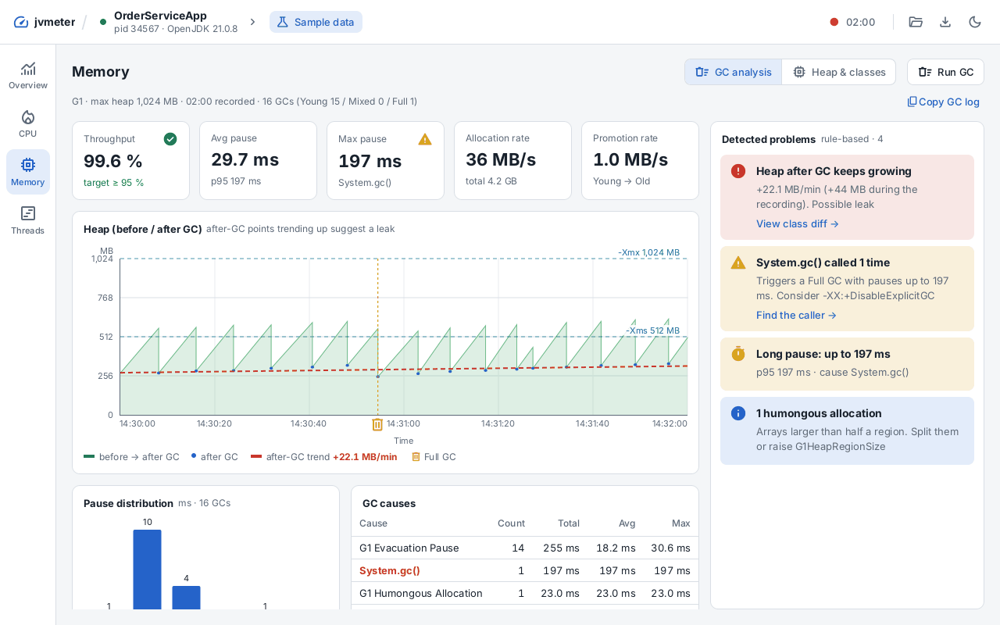
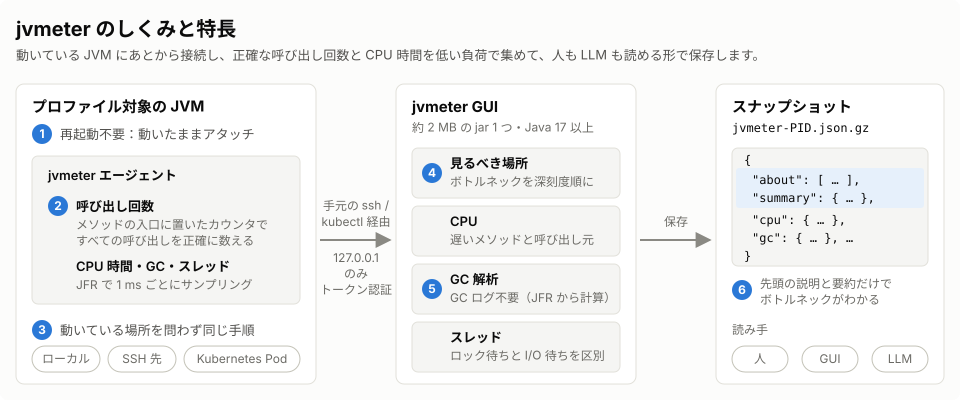
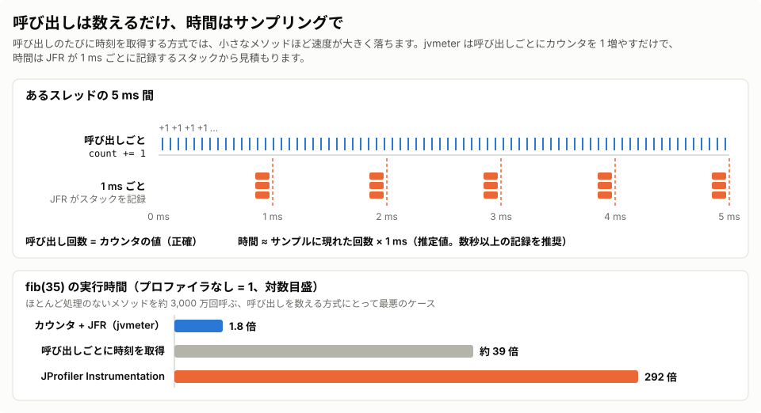
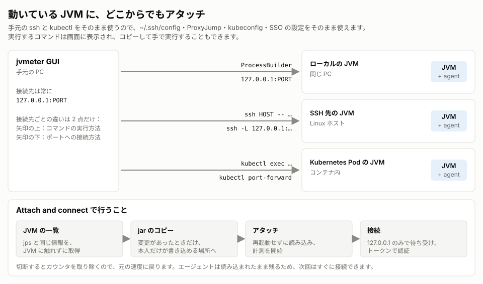
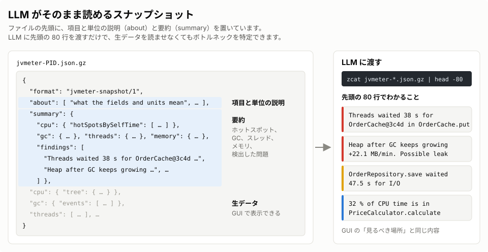

# jvmeter

[](https://github.com/yukkes/jvmeter/actions/workflows/release.yml)
[](https://github.com/yukkes/jvmeter/releases)
[](#ソースコードからのビルド)
[](LICENSE)

[English](README.md) | **日本語**

**オープンソースの低オーバーヘッド × 高精度な JVM プロファイラ**

メソッド呼び出し回数はバイトコード計測で正確にカウントし、CPU 時間は JFR（Java Flight Recorder）サンプリングで軽量に測定。
稼働中の JVM に後から動的アタッチでき、ローカル環境・SSH 先のリモートサーバー・Kubernetes Pod を同一の手順でプロファイリング可能です。
結果はコンパクトな JSON スナップショットとして保存され、人間が GUI で読むのはもちろん、そのまま LLM に渡して原因分析させることもできます。



---

## 📌 目次
- [主な特長](#主な特長)
- [設計思想としくみ](#設計思想としくみ)
- [クイックスタート](#クイックスタート)
  - [1. 稼働中の JVM にアタッチ（推奨）](#1-稼働中の-jvm-にアタッチ推奨)
  - [2. 起動時からエージェントを適用して記録](#2-起動時からエージェントを適用して記録)
- [画面・分析機能](#画面分析機能)
- [推奨 JVM オプション](#推奨-jvm-オプション)
- [オーバーヘッドと性能評価](#オーバーヘッドと性能評価)
- [エージェント設定・CLI 操作](#エージェント設定cli-操作)
- [セキュリティとプライバシー](#セキュリティとプライバシー)
- [ソースコードからのビルド](#ソースコードからのビルド)
- [ライセンス](#ライセンス)

---

## 主な特長



*※ 上図の丸付き番号は、下表の各項目に対応しています。*

| # | 特長 | 概要 | 詳細 |
|:---:|---|---|---|
| **①** | **プロセスの再起動が不要** | トラブル発生後、稼働中の JVM に GUI から直接アタッチ可能です。 | [アタッチ手順](#1-稼働中の-jvm-にアタッチ推奨) |
| **②** | **正確な呼び出し回数と低負荷の両立** | 最悪条件でもオーバーヘッドは約 1.8 倍（従来のインストルメンテーション型は約 290 倍）。 | [しくみ](#設計思想としくみ) / [オーバーヘッド](#オーバーヘッドと性能評価) |
| **③** | **環境に依存しない統一された操作感** | ローカル・SSH・Kubernetes いずれも手元の `ssh` / `kubectl` をそのまま使って透過的に接続できます。接続先へのエージェントの事前インストールは不要です。 | [アタッチ手順](#1-稼働中の-jvm-にアタッチ推奨) |
| **④** | **見るべきポイントを自動提示（Where to look）** | 検出されたボトルネックを深刻度順に自動ソートして提示します。 | [画面・分析機能](#画面分析機能) |
| **⑤** | **GC ログ設定なしで詳細分析** | JFR イベントから GCeasy 相当の指標算出・問題検知を実施。外部サービスへデータを送信しません。 | [GC 解析](docs/gc-analysis.md) |
| **⑥** | **LLM フレンドリーなスナップショット** | JSON の先頭 80 行を読むだけでプロファイルの要点が把握できる構造になっています。 | [スナップショット活用](#スナップショットの確認と-llm-連携) |

- **Java のインストール不要**: GUI（Swing + FlatLaf、エージェント同梱）は、Java ランタイムを内蔵した Windows / macOS / Linux 向けのアプリとして配布しています。
- **オープンソース**: MIT ライセンスで提供されています。

---

## 設計思想としくみ

### 1. 呼び出し回数はカウントのみ、CPU 時間はサンプリングで計測
従来のインストルメンテーション方式はメソッド境界でタイマーを取得するため極めて重く、純粋なサンプリング方式では呼び出し回数が分かりません。jvmeter は **「呼び出し回数は軽量なインクリメントのみ」「時間は JFR でサンプリング」** と役割を分離することで、正確さと低オーバーヘッドを両立しています。



### 2. どこからでもシームレスにアタッチ
ローカルプロセスだけでなく、SSH 先のサーバーや Kubernetes Pod 内のコンテナに対しても、使い慣れたクライアントツール経由で安全に接続・プロファイルできます。
エージェントは GUI に同梱されており、アタッチ時に接続先のサーバーやコンテナへ自動でコピーされます（同じ jar がすでにあればコピーを省略）。接続先に事前に何かをインストールしておく必要はありません。



### 3. LLM がそのまま読める軽量スナップショット
プロファイル結果は Gzip 圧縮された JSON（`.json.gz`）として出力されます。先頭部分に環境情報（`about`）と重要指標（`summary`）が集約されているため、LLM にスナップショットの先頭を渡すだけで的確なボトルネック診断を受けられます。



---

## クイックスタート

[Releases](https://github.com/yukkes/jvmeter/releases) からお使いの OS 用のアプリをダウンロードして展開します。Java のインストールは不要で、エージェントも同梱されています。

| ファイル | 起動 |
|---|---|
| `jvmeter-<version>-windows-x64.zip` | `jvmeter\jvmeter.exe` |
| `jvmeter-<version>-macos-arm64.zip` | `jvmeter.app` |
| `jvmeter-<version>-linux-x64.tar.gz` | `jvmeter/bin/jvmeter` |

アプリには署名がありません。macOS では初回にブロックされたら **システム設定 › プライバシーとセキュリティ** で jvmeter を許可し、Windows では **詳細情報 › 実行** を選んでください。

### 1. 稼働中の JVM にアタッチ（推奨）

1. jvmeter を起動すると **Start Center** が開きます。
2. **Local** / **SSH** / **Kubernetes** の中から接続先を選択すると、検出された JVM プロセスの一覧が表示されます。
3. 対象の JVM を選び、**Count calls in** に呼び出しを正確にカウントしたいパッケージ名（例: `com.example`）を入力します。
4. **Attach and connect** をクリックするとプロファイリングが開始され、画面が 1 秒ごとに更新されます。
5. 上部バーの **Save**（ダウンロードのアイコン）でスナップショットを保存できます。

> **Tips:** 画面構成や見え方を手元ですぐ試したい場合は、Start Center の **Sample data**（架空の注文サービスのサンプルプロファイル）を開いてください。

---

### 2. 起動時からエージェントを適用して記録

バッチ処理など、プロセスの起動直後から終了時までをプロファイルしたい場合は、JVM 起動オプションにエージェントを指定します。
エージェントの JAR とデモアプリはリリースに含まれないため、[ソースからビルド](#ソースコードからのビルド)してください。

```bash
java -XX:+UnlockDiagnosticVMOptions -XX:+DebugNonSafepoints \
  -javaagent:jvmeter-agent.jar \
  -cp jvmeter-demo.jar app.Mix
```

プロセス終了時に自動で `jvmeter-<PID>.json.gz` が生成されます。また、記録の実行中に GUI から接続してリアルタイム監視することも可能です。

#### スナップショットの確認と LLM 連携

```bash
# GUI でスナップショットを開く（上部バーのフォルダーのアイコンからも開けます）
jvmeter/bin/jvmeter jvmeter-12345.json.gz

# 先頭 80 行（about / summary）を抽出して確認（この部分を LLM に渡して分析）
zcat jvmeter-12345.json.gz | head -80
```

---

## 画面・分析機能

GUI 上では、目的別に以下のビューが提供されています。

| ビュー | 主な機能と確認できる内容 |
|---|---|
| **Overview** | CPU・ヒープ・GC・スレッドのサマリータイル、および深刻度順にボトルネックを一覧表示する「Where to look」パネル。 |
| **CPU** | ホットスポット分析（Self / Total 時間、呼び出し回数、1 回あたりの平均所要時間、呼び出し元）、コールツリー表示、メソッド検索。 |
| **Memory › GC analysis** | GC の主要 KPI、自動検知ルールによる問題点の指摘、GC 前後のヒープサイズ推移と傾き、STW 停止時間分布、GC 発生原因の内訳、世代別メモリサイズ、アロケーション元のメソッド特定、Unified Logging 形式での GC ログコピー。 |
| **Memory › Heap & classes** | ヒープメモリ推移、クラス別インスタンス数とサイズ、スナップショット間の差分比較（Before / After）、手動 GC の実行。リーク調査（マーク付け → 待機 → GC → 増加クラスの特定）に最適。 |
| **Threads** | スレッドごとの状態遷移タイムライン、待機要因（ロック競合／I/O 待ち、ロック保持スレッドの特定）、状態別累積時間、現在のスタックトレース。 |

- **UI テーマ**: ライトモードとダークモードの切り替えに対応（デフォルトは OS の外観設定に追従）。

---

## 推奨 JVM オプション

以下のオプションはエージェント自体を読み込むものではないため、本番環境を含む**プロファイルを実施する可能性があるすべての JVM にあらかじめ付与しておくことを推奨**します。

```bash
-XX:+EnableDynamicAgentLoading -XX:+UnlockDiagnosticVMOptions -XX:+DebugNonSafepoints
```

- **`-XX:+DebugNonSafepoints`**:  
  JIT によるインライン化が行われたメソッドの実行時間が呼び出し元メソッドに合算されてしまうのを防ぎます。起動時にのみ指定可能です（未指定の JVM では GUI 上部に「Inlined → callers」と警告表示されます）。
- **`-XX:+EnableDynamicAgentLoading`**:  
  JDK 21 以降において、動的アタッチ時の警告ログ出力を抑制します（JEP 451 により、将来の JDK では指定がないと動的アタッチが拒否される予定です）。

> **Kubernetes での利用:**  
> Pod のマニフェスト等で環境変数 `JDK_JAVA_OPTIONS` に上記オプションを設定しておくのが便利です（Start Center の「Prepare a JVM」にも設定サンプルが表示されます）。

---

## オーバーヘッドと性能評価

プロファイラなしの実行時間を基準（1.00×）としたときのオーバーヘッド比較です（JDK 25 環境にて、稼働中 JVM へのアタッチ記録時）。

| プロファイラ設定 | fib(35)<br><sub>極小メソッドを大量呼出（最悪ケース）</sub> | app.Load<br><sub>4 スレッド高負荷サービス（実環境想定）</sub> | 呼出回数の精度 |
|---|---:|---:|:---:|
| **jvmeter** | **1.80×** | **1.24×** | **正確** |
| JProfiler (Instrumentation) | 292× | 22× | 正確 |
| JProfiler (Full sampling) | 1.00× | 1.14× | 計測不可 |

- JDK 17 / 21 での測定結果、詳細なベンチマーク環境、オーバーヘッドの内訳については [`docs/benchmarks.md`](docs/benchmarks.md) を参照してください。
- エージェントコードの変更時には、性能リグレッションテスト [`demo/overhead.sh`](demo/overhead.sh) がパスすることを確認しています（目標基準: fib 2.0× 以下、`app.Load` 1.3× 以下）。

---

## エージェント設定・CLI 操作

### 起動オプション・システムプロパティ一覧

| 指定フラグ | 説明 | デフォルト値 |
|---|---|---|
| `-javaagent:jvmeter-agent.jar=include=<pkg>`<br>`-Djvmeter.include=<pkg>` | 呼び出し回数を計測するパッケージのカンマ区切り指定。<br>※ CPU 時間のサンプリングはパッケージ指定に関わらず全メソッドが対象です。 | main クラスが属するパッケージ |
| `-Djvmeter.period=<ms>` | サンプリング周期（ミリ秒）。スレッド数が多く高負荷な環境を長時間記録する場合に引き上げます。 | `1` |
| `-Djvmeter.out=<path>` | JVM 終了時に書き出すスナップショットファイルの保存先パス。 | `jvmeter-<PID>.json.gz` |
| `-javaagent:jvmeter-agent.jar=port=<port>` | GUI からの接続を受け付けるポート番号（`127.0.0.1` および `::1` のみでリッスン）。 | ランダムな空きポート |

### エージェント JAR による CLI 操作

[ソースからビルド](#ソースコードからのビルド)したエージェントの JAR を使えば、GUI を使用せずにコマンドラインからプロセスの確認やアタッチを行うことも可能です。

```bash
# 実行ユーザー権限で動作している JVM 一覧を表示（jps -v 相当）
java -jar jvmeter-agent.jar list

# 指定した PID の JVM にアタッチしてプロファイルを開始
java -jar jvmeter-agent.jar attach <PID> include=com.example
```

---

## セキュリティとプライバシー

- **完全ローカル処理**: プロファイルデータや GC 解析データはすべてローカル環境内で処理・保持され、外部ネットワークやサードパーティのサーバーに送信されることは一切ありません。
- **ループバック限定リッスン**: エージェントの待受ポートは `127.0.0.1`（IPv4）および `::1`（IPv6）のループバックアドレスに限定されており、外部インターフェースに直接ポートが公開されることはありません。
- **安全なリモート接続**: リモート診断時は SSH ポートフォワーディング（`ssh -L`）や `kubectl port-forward` を活用して安全にトンネリング通信を行います。

---

## ソースコードからのビルド

ビルドには **JDK 17 以上** が必要です。

```bash
# リポジトリのクローン
git clone https://github.com/yukkes/jvmeter.git
cd jvmeter

# Maven Wrapper を用いてビルド・パッケージング
./mvnw clean package
```

ビルドが成功すると、以下の JAR ファイルが生成されます：
- GUI: `gui/target/jvmeter-gui.jar`（Java 17 以上で `java -jar gui/target/jvmeter-gui.jar`）
- エージェント: `agent/target/jvmeter-agent.jar`
- デモアプリ: `demo/target/jvmeter-demo.jar`

続けて `gui/app-image.sh <version>`（JDK 21 以上）を実行すると、リリースと同じ形式のアプリを実行中の OS 向けに作成できます。

---

## ライセンス

本プロジェクトは [MIT License](LICENSE) のもとで公開されています。
