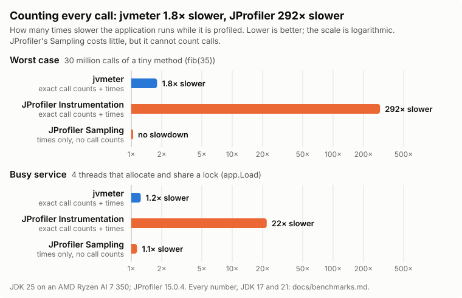

# Benchmarks: overhead, and jvmeter next to JProfiler

What profiling costs, measured on two workloads, with jvmeter and with JProfiler 15.0.4 on the same machine.
Raw output: [`results/profilers-2026-10-06.txt`](results/profilers-2026-10-06.txt) and
[`results/sampling-2026-10-06.txt`](results/sampling-2026-10-06.txt).

## How it is measured

| Workload | What it stresses |
|---|---|
| **fib** | `app.Fib.fibRecursive(35)`: about 30 million calls of a method that does almost nothing. The worst case for anything that runs on every call |
| **load** | one round of `app.Load`: 4 threads that build maps and strings, allocate, and share a lock. A busy service: JFR sampling, thread samples and GC matter more than calls |
| **map** | what one thread of `app.Load` does (HashMap and strings), used to find out what loading a profiler costs |

- `app.Rounds` runs a workload in one JVM per line, with the profiler going through its states (jvmeter: before attach, attached,
  recording, disconnected; JProfiler: recording off, on, off again). Each state is the median of 7 rounds.
- **JIT**: a change of state throws compiled code away (methods are instrumented or restored), so the rounds of the first 0.5 s
  after each change are left out while the JIT compiles again. Instrumentation that makes a tiny method bigger can change what the
  JIT inlines; that cost is real and stays in the numbers.
- **Noise**: the machine's speed drifts by 5–7 % over minutes, more than many of the differences measured, so every ratio
  compares runs made close in time. `demo/profilers.sh` runs every line once per cycle, between two JVMs without a profiler, and
  takes a line's ratio against the mean of those two (attached: against the same JVM before attaching); two cycles run in turns
  (CYCLES=2, 272 s for three JDKs). The tables show the median ratio and, in brackets, its range over the cycles: within ±4 % on
  fib and ±5 % on `app.Load`. The heap is fixed (`-Xms1g -Xmx1g`), so heap sizing does not change between JVMs.
  **Differences inside those ranges are noise and are not used below.**
- Every JVM runs with `-XX:+UnlockDiagnosticVMOptions -XX:+DebugNonSafepoints -XX:+EnableDynamicAgentLoading`
  ([`targets.md`](targets.md)).
- JProfiler is loaded with `-agentpath:libjprofilerti.so=port=…,nowait,id=1,config=…`, only the package `app.` profiled, and CPU recording
  switched with its `RemoteController` MBean. Its three method call recording types: **Instrumentation** (`methodCallRecordingType="instrumentation"`,
  auto-tuning off), **Full sampling** (`sampling`) and **Async sampling** (`async`), both every 5 ms, its default.
  jvmeter samples every 1 ms.
- Machine: AMD Ryzen AI 7 350, 8 CPUs and 8 GB given to WSL2, on AC power (on battery the numbers rise and scatter more).

## Results

Median round, and × against no profiler (jvmeter attached: against the same JVM before attaching).



The chart shows one point for a first reader, from the JDK 25 column of the tables below: jvmeter attached, JProfiler's
Instrumentation and its default Full sampling (`python3 docs/figures/overhead.py` draws it). Every other line is in the tables.

### fib(35)

| | JDK 17 | JDK 21 | JDK 25 |
|---|---:|---:|---:|
| No profiler | 18.3 ms | 18.1 ms | 18.1 ms |
| **jvmeter, recording** (attached) | **1.93× [1.86–1.99]** | **1.81× [1.77–1.84]** | **1.80× [1.80–1.81]** |
| jvmeter, recording (`-javaagent`, samples every 1 ms) | 1.80× [1.76–1.84] | 1.77× [1.76–1.77] | 1.78× [1.77–1.80] |
| jvmeter, samples every 3 ms (`-Djvmeter.period=3`) | 1.72× [1.71–1.74] | 1.70× [1.69–1.72] | 1.70× [1.70–1.71] |
| jvmeter, samples every 5 ms (`-Djvmeter.period=5`) | 1.70× [1.69–1.72] | 1.69× [1.68–1.71] | 1.68× [1.68–1.69] |
| JProfiler Instrumentation, recording | 332× | 289× | 292× |
| JProfiler Full sampling, recording | 0.99× [0.98–1.00] | 1.01× [1.01–1.01] | 1.00× [1.00–1.00] |
| JProfiler Async sampling, recording | 0.99× [0.98–0.99] | 1.00× [0.99–1.00] | 1.01× [1.01–1.01] |

### load

| | JDK 17 | JDK 21 | JDK 25 |
|---|---:|---:|---:|
| No profiler | 101.7 ms | 96.9 ms | 83.2 ms |
| **jvmeter, recording** (attached) | **1.34× [1.28–1.39]** | **1.39× [1.38–1.40]** | **1.24× [1.22–1.25]** |
| jvmeter, recording (`-javaagent`, samples every 1 ms) | 1.24× [1.23–1.26] | 1.29× [1.26–1.32] | 1.44× [1.39–1.48] |
| jvmeter, samples every 3 ms (`-Djvmeter.period=3`) | 1.20× [1.20–1.20] | 1.23× [1.18–1.29] | 1.37× [1.32–1.41] |
| jvmeter, samples every 5 ms (`-Djvmeter.period=5`) | 1.18× [1.14–1.22] | 1.25× [1.18–1.32] | 1.33× [1.28–1.38] |
| JProfiler Instrumentation, recording | 20× | 21× | 22× |
| JProfiler Full sampling, recording | 1.18× [1.17–1.18] | 1.24× [1.20–1.27] | 1.14× [1.08–1.20] |
| JProfiler Async sampling, recording | 1.16× [1.15–1.16] | 1.24× [1.21–1.26] | 1.11× [1.08–1.14] |

JProfiler's Instrumentation rows come from one JVM per line in an earlier run (`JP_INSTRUMENTATION=1` adds them, about a minute
a cycle); at 20–330× the noise does not matter.

**What the numbers say**

- Exact call counts cost jvmeter 1.8–1.9× on the worst case and JProfiler's Instrumentation about 290×: **160 times less**.
  On the busy service, 1.2–1.4× against about 20×.
- JProfiler's sampling costs nothing on fib and 1.1–1.25× on the busy service, but it has no call counts and samples every 5 ms
  instead of 1 ms. Its cost on the busy service is there before it records anything (recording off: the same ratio, in the raw
  output). Why turning it on costs nothing: [below](#why-sampling-looks-free).
- Sampling every 3 or 5 ms instead of 1 ms: fib 1.8× → 1.7× (the counters are its cost), the busy service about 0.05–0.1× less;
  3 and 5 ms are about the same. Times get coarser: a method needs 3–5 times as long a recording for the same number of samples.
- Attached or `-javaagent` on the busy service: the one or the other costs up to 0.2× more depending on the JDK; on JDK 25,
  `-javaagent` costs more, as on the HashMap-heavy code below.

## Where jvmeter's overhead comes from

| Part | What it does | fib (JDK 25) | load (JDK 25) | Measured as |
|---|---|---:|---:|---|
| **Call counters** | one increment at each entry of a counted method | **+12 ms (1.66×)** | +2–7 % | attached, not recording, against before attaching |
| **JFR execution samples, every 1 ms** | pauses each running thread briefly and walks its stack | +4 % | **+24 %** (+17 % every 5 ms) | JFR with only `jdk.ExecutionSample` (`sampling.sh`) |
| The rest of a recording | allocation samples (150/s), GC events, the agent's own work on the events on its thread, thread states every 100 ms, telemetry every second | +2 ms | within the noise | recording, against the two rows above |
| Class histogram, every 30 s | `GC.class_histogram`: pauses the JVM about 50 ms per GB of heap | — | — | not in these runs (each state lasts a few seconds) |
| **Loading with `-javaagent`** | the JVM's own startup work for any agent pollutes the JIT's type profiles | none | up to +24 % on HashMap-heavy code (map) | an agent that does nothing (`sampling.sh`) |

**Call counters.** Each counted method starts with `CallCounter.hit`: an array increment in a slot of the calling thread
(no atomics, no clock reads, no shadow stack, nothing at exit). The cost is not the instruction but the wait: a method called again
and again (a loop, a recursion) increments the same address, and each increment waits for the store before it, 4–5 CPU cycles.
The method's first integer argument picks one of 8 counters in the thread's slot, so consecutive calls rarely wait for each other:
0.4 ns a call now, 0.9 ns before (fib 2.7× on JDK 17) ([`design.md`](design.md)). Counts stay exact (`CountTransformerTest`).
Only the packages chosen in "Count calls in" are counted; code with few, longer calls (a service) hardly notices them.

**JFR execution samples.** Every 1 ms, JFR stops each thread that runs Java code, walks its stack and records it. One thread
(fib) barely notices; four busy threads do, as each loses that time once a millisecond. jvmeter samples every 1 ms for exact times
in short recordings; `-Djvmeter.period=3` or `5` samples less often (JFR alone 1.24× → 1.17×; jvmeter on JDK 25 1.44× → 1.33×), with coarser times.
The samples are processed on the agent's own thread, which shows as more CPU time of the process, not as a slower application,
unless the CPUs are all busy.

**1 ms or 3 ms?** Keep the default of 1 ms; use `-Djvmeter.period=3` for long recordings of busy, many-threaded services where every
percent of overhead matters.

- What 3 ms saves: 0.05–0.1× (fib 1.78× → 1.70×; `app.Load` 1.24–1.44× → 1.20–1.37×), about the size of the noise on `app.Load`.
  Where calls are many and tiny, the counters are the cost and the period hardly matters. 5 ms saves no more than 3 ms.
- What it costs: a third of the samples, so a method's time is √3 ≈ 1.7 times less certain. For a method with 1 % of a busy
  thread's time, 10 s of recording give 100 samples (±10 %) every 1 ms and 33 (±17 %) every 3 ms; a minute gives 600 (±4 %)
  against 200 (±7 %). Exact call counts are only as useful as the time per call next to them, and the CPU view updates every 5 s,
  so short recordings need the finer period.

**Loading with `-javaagent`.** With any agent on the command line, even one that does nothing, the JVM turns off CDS's archived
module graph and builds it at startup, and loads the agent, in Java code that uses `HashMap` with keys of many classes before the
application runs. The JIT then sees many receivers in `HashMap.hash` and inlines less: HashMap-heavy code runs up to 1.24× slower,
for the life of the JVM, whatever the agent does. It cannot be avoided inside the agent; attaching to a running JVM avoids it
([below](#why-sampling-looks-free)).

## Recording on and off: where the time goes

| State (JDK 25) | fib | load | What runs |
|---|---:|---:|---|
| jvmeter before attach | 18.1 ms | 89.6 ms | nothing |
| jvmeter attached, not recording | 30.1 ms (1.66×) | 91.0 ms (1.02×) | the call counters (they are installed when the agent loads) |
| jvmeter recording | 32.5 ms (1.80×) | 110.9 ms (1.24×) | counters, JFR (execution samples every 1 ms, allocation samples, GC events), thread states every 100 ms, telemetry every second, a class histogram every 30 s |
| jvmeter disconnected | 18.1 ms (1.00×) | 98.9 ms (1.10×) | nothing: the counters are taken out again |
| JProfiler Instrumentation, recording off | 17.6 ms | 95.4 ms | the agent, before the first recording |
| JProfiler Instrumentation, recording on | 5,261 ms | 1,987 ms | instrumented call tree with times |
| JProfiler Instrumentation, recording off again | 24.9 ms (1.41×) | 115.6 ms (1.21×) | the instrumentation stays after recording stops (× against recording off) |

- **Off**: after disconnecting, fib runs as fast as before at once. `app.Load` is still 1.04–1.10× in the first seconds, with the
  process's CPU time higher, most likely while the JIT compiles the code without counters again. JProfiler keeps its
  instrumentation after recording stops (1.2–1.4× until the JVM restarts).

Known gap, not fixed yet: between attaching and the start of recording the counters already run (fib 1.66×). The GUI starts
recording as soon as it connects, so this lasts only a moment there.

## Why sampling looks free

JProfiler's Full and Async sampling add nothing when recording starts. `demo/sampling.sh` (about 45 s) looks for the reason
([`results/sampling-2026-10-06.txt`](results/sampling-2026-10-06.txt), JDK 25).

1. **Taking samples is cheap, in JFR too.** On fib, JFR's execution samples every 1 ms cost 1.04×, JProfiler's 1.0×, and the same
   on a single CPU (`taskset -c 0`), with the process's CPU time unchanged: the work is small, not moved to idle cores.
   With four busy threads (`app.Load`) samples every 1 ms do cost: 1.24×, 1.17× every 5 ms.
2. **JProfiler is measured against itself.** Its "recording on" is compared with "recording off", the agent already loaded.
   Against no profiler, loading it already costs up to 1.2× on `app.Load` on JDK 17 and 21 (the table above).
3. **Loading an agent at startup slows the application's JDK code down: the JIT's type profiles are polluted.** With `-javaagent`,
   even an agent that does nothing (`app.EmptyAgent`), the JVM turns off CDS's archived module graph (`-Xlog:cds`: "full module
   graph: disabled"), builds it at startup and loads the agent, in Java code that uses `HashMap` with keys of many classes before
   the application runs. `HashMap.hash` then sees many receivers for `key.hashCode()`, and C2 inlines `Integer.hashCode` in fewer
   places (`-XX:+PrintInlining`, `app.Parts`: 15–21 without an agent, 3–12 with an agent that does nothing, 1 with JFR
   started with the JVM; it varies from JVM to JVM). On map, with nothing recorded:

   | map (JDK 25) | one JVM | 3 JVMs, earlier the same day |
   |---|---:|---:|
   | No profiler | 36.0 ms | 33.1 ms [33.1–34.5] |
   | No CDS module graph (`--add-modules`), no agent | 41.1 ms (1.14×) | 35.8 ms [35.5–39.4] (1.08×) |
   | An agent that does nothing (`-javaagent`) | 45.5 ms (1.26×) | 41.0 ms [35.5–41.0] (1.24×) |
   | JFR started with the JVM, no events | 44.8 ms (1.24×) | 41.0 ms [40.6–41.7] (1.24×) |
   | JFR started after warming up, no events | 36.5 ms (1.01×) | 33.0 ms [33.0–33.7] (1.00×) |

4. **So the cost comes with what is loaded at startup, not with sampling.** It cannot be avoided inside the agent: an agent that
   does nothing already costs 1.24×, and starting JFR later from `-javaagent` (tried, 0.2–2 s) changed nothing.
   A JVM that a profiler attaches to later keeps the code it compiled with clean profiles: on map, jvmeter attached and
   recording is 1.27× (45.6 ms against 35.9 ms before attaching), with `-javaagent` 1.41× (50.9 ms).

For numbers close to the application's own, attach to the running JVM ([`targets.md`](targets.md), "Attaching later");
`-javaagent` is for recording from the very start, and the cost of loading any agent then comes with it.

## The overhead gate

`demo/overhead.sh` runs fib(35) and `app.Load` three times each with the agent (`-javaagent`) and without, in turns, in about 30 s,
and fails above 2.0× and 1.3×, the same limits on every JDK, under act and on GitHub Actions (its 2-vCPU runner measured fib 1.97×
and `app.Load` 1.07×; the script says why each limit is where it is). It is the gate for every change to the agent (`AGENTS.md`).

The run without profiling starts the JVM the way `-javaagent` does, with CDS's archived module graph off (`--add-modules`), so the
ratio is the agent's own cost. From JDK 25 on, that archive alone makes `app.Load` about 10 % faster (91 ms against 101 ms with it
off, JDK 17: 101 ms against 104 ms), and any `-javaagent`, even one that does nothing, gives that up: against a plain JVM, jvmeter
looked 1.32× on JDK 25 and 1.28× on JDK 17 while its own time was lower on JDK 25 (120 ms against 129 ms).
Why the archive helps this code is not settled: fewer places where C2 inlines `Integer.hashCode` (above) is not all of it,
as `-Xshare:off` inlines as few and is faster still on JDK 25 (82 ms).

| 2026-10-06 | JDK 17 | JDK 25 |
|---|---:|---:|
| fib(35) | 1.81× | 1.82× |
| `app.Load` | 1.22× | 1.19× |

## JSON binding libraries

jvmeter reads snapshots and the agent's messages as JSON. The library has to work in a `jlink` runtime without `jdk.unsupported`
(Gson's `Unsafe.allocateInstance` fails there for classes without a no-args constructor), so the candidates were the ones that
generate code at compile time. Measured on one payload of each kind jvmeter moves (`list` ≈ the `agent.jar list` output of 60
JVMs, `tree` ≈ a CPU call tree of ~99 KB), 3,000 rounds each after a warm-up, on this machine (JDK 25, no JMH harness):

| Library | `list` read | `tree` read | `tree` write | How it binds |
|---|---:|---:|---:|---|
| **avaje-jsonb 3.16** | **30.9 ms** | **456 ms** | **831 ms** | adapters generated at compile time, registered through ServiceLoader — no reflection, no Unsafe |
| Jackson 2.20 + Afterburner | 29.3 ms | 656 ms | 1124 ms | databind; bytecode-generated accessors, but still builds the POJO model by reflection |
| Jackson databind 2.20 | 44.4 ms | 854 ms | 1377 ms | reflection |
| jackson-jr 2.22 + annotation support | 48.2 ms | 831 ms | 1352 ms | scans beans by reflection (only the streaming core is reflection-free) |
| Gson 2.14 | 43.9 ms | 1051 ms | 1675 ms | reflection, `Unsafe.allocateInstance` without a no-args constructor |

Raw output and the benchmark source: [`results/json-libs.txt`](results/json-libs.txt),
[`results/Bench.java`](results/Bench.java).

Sizes that end up in `jvmeter-gui.jar`: Gson 0.28 MB, avaje-jsonb + avaje-json-core 0.39 MB, jackson-databind + core +
annotations 2.4 MB, Moshi + okio + kotlin-stdlib ~2.7 MB. avaje-jsonb is both the fastest of these and keeps the jar size about
where Gson was; it replaced Gson in `core` (the model classes carry `@Json` and the generated adapters do the rest).
Moshi's codegen is reflection-free too, but its Kotlin runtime makes the distribution much bigger.

## Running it

```bash
./mvnw package
demo/overhead.sh                                            # the gate, about 30 s
JPROFILER_HOME=path/to/jprofiler15.0.4 demo/profilers.sh    # the tables above, about 90 s per JDK
JPROFILER_HOME=path/to/jprofiler15.0.4 demo/sampling.sh     # why sampling looks free, about 45 s
```

Without `JPROFILER_HOME` the JProfiler rows are left out; `JP_INSTRUMENTATION=1` adds Instrumentation (about a minute),
`CYCLES=3` runs a third cycle; in `sampling.sh`, `RUNS=3` repeats every line in 3 JVMs and prints the range. JProfiler's own license applies to running it.
